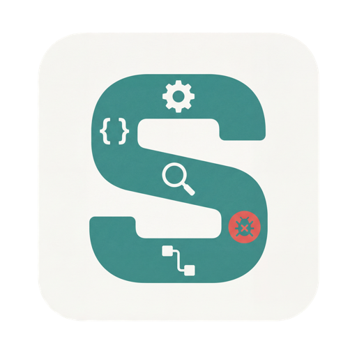

<p align="center">
  
</p>

<h1 align="center">SAF — Static Analyzer Factory</h1>

<p align="center">
  <a href="LICENSE"></a>
  <a href="https://www.python.org"></a>
  <a href="https://www.rust-lang.org"></a>
</p>

A Rust-powered static analysis framework with a Python SDK for finding bugs in C/C++ programs. SAF turns LLVM IR into analyzable graphs — pointer analysis, value-flow, taint tracking — and exposes them through a clean Python API and CLI.

## Key Features

- **Pointer analysis** — Andersen-style with field sensitivity, context-sensitive (k-CFA), and flow-sensitive variants
- **Value-flow graphs** — SSA + memory + interprocedural edges for precise data-flow tracking
- **Taint analysis** — source/sink/sanitizer framework with trace extraction
- **IFDS solver** — interprocedural, finite, distributive subset analysis
- **Built-in checkers** — memory leaks, null dereference, double-free, use-after-free, and more
- **Python SDK** — first-class API for scripting custom analyses
- **CLI** — full analysis pipeline from the command line
- **Deterministic** — identical inputs always produce byte-identical outputs
- **SARIF export** — standard format for IDE and CI integration

## Quick Start

SAF runs inside Docker. Two image variants are published, one per supported
LLVM version — pick the tag whose LLVM matches the clang you use to compile
your source.

```bash
git clone https://github.com/Static-Analyzer-Factory/static-analyzer-factory.git
cd static-analyzer-factory
make shell            # dev shell backed by LLVM 18 (default)
make shell-llvm22     # dev shell backed by LLVM 22 (opt-in)
```

See [docs/book/src/getting-started/llvm-versions.md](docs/book/src/getting-started/llvm-versions.md)
for the support policy and forward-incompatibility caveats.

### Python SDK

```python
from saf import Project, sources, sinks

proj = Project.open("program.ll")
q = proj.query()

# Find taint flows from user input to dangerous sinks
findings = q.taint_flow(
    sources=sources.function_param("main", 1),   # argv
    sinks=sinks.call("system", arg_index=0),
)

for f in findings:
    print(f"{f.severity}: {f.message}")
    print(f"  {f.source_location} -> {f.sink_location}")
```

### CLI

```bash
# Run all built-in checkers
saf run program.ll --checkers all --format json --output findings.json

# Export call graph as DOT
saf export callgraph --input program.ll --format dot --output cg.dot

# Query points-to set for a specific value
saf query points-to 0x00000042 --input program.ll
```

## Architecture

```
crates/
  saf-core/       # AIR (Analysis IR), config, deterministic IDs
  saf-frontends/  # LLVM bitcode + AIR-JSON frontends
  saf-analysis/   # CFG, call graph, PTA, value-flow, checkers
  saf-cli/        # Command-line interface
  saf-python/     # Python SDK (PyO3 bindings)
  saf-wasm/       # Browser build (playground)
```

**Data flow:**

```
Input (.ll / .bc)
  → Frontend → AIR (canonical IR)
    → Graph builders (CFG, call graph, def-use)
      → Pointer analysis → Value-flow graph
        → Queries & checkers → Findings (JSON / SARIF)
```

## Benchmark Results

SAF's memory-safety checkers evaluated on the [NIST Juliet C/C++ Test Suite](https://samate.nist.gov/SARD/test-suites/112), compared against [SVF](https://github.com/SVF-tools/SVF) and [Lotus](https://github.com/ZJU-PL/lotus).

### Memory Leak (CWE-401) — 1,408 tests

| Tool | TP | FP | FN | TN | Precision | Recall | F1 |
|:-----|---:|---:|---:|---:|----------:|-------:|---:|
| **SAF** | **694** | **85** | **16** | **613** | **89.1%** | **97.7%** | **0.932** |
| SVF | 666 | 144 | 44 | 554 | 82.2% | 93.8% | 0.876 |

### Double Free (CWE-415) — 385 tests

| Tool | TP | FP | FN | TN | Precision | Recall | F1 |
|:-----|---:|---:|---:|---:|----------:|-------:|---:|
| **SAF** | **180** | **5** | **15** | **185** | **97.3%** | **92.3%** | **0.947** |
| SVF | 170 | 0 | 25 | 190 | 100.0% | 87.2% | 0.932 |
| Lotus | 163 | 34 | 32 | 156 | 82.7% | 83.6% | 0.829 |

### Use-After-Free (CWE-416) — 236 tests

| Tool | TP | FP | FN | TN | Precision | Recall | F1 |
|:-----|---:|---:|---:|---:|----------:|-------:|---:|
| **SAF** | **90** | **4** | **28** | **114** | **95.7%** | **76.3%** | **0.849** |
| Lotus | 92 | 14 | 26 | 104 | 86.8% | 78.0% | 0.784 |

### Null Pointer Dereference (CWE-476) — 468 tests

| Tool | TP | FP | FN | TN | Precision | Recall | F1 |
|:-----|---:|---:|---:|---:|----------:|-------:|---:|
| SAF | 188 | 79 | 46 | 155 | 70.4% | 80.3% | 0.750 |
| **Lotus** | **199** | **55** | **35** | **179** | **78.3%** | **85.0%** | **0.792** |

## Known Limitations

**Analysis precision:**
- Default pointer analysis is context-insensitive; context-sensitive (k-CFA), flow-sensitive, and demand-driven variants are available but may be slower on large programs
- Array elements are treated as a single abstract object — no per-index tracking

**Indirect calls:**
- Indirect call resolution depends on PTA precision — targets that PTA misses are invisible to downstream analyses (ICFG, IFDS, taint)
- When a call site resolves to multiple targets, only the first is used in value-flow and SVFG

**Not yet supported:**
- Source-level frontends (Clang AST, rust-analyzer) — architecture is ready, implementation is planned
- Symbolic execution

## AI-Assisted Development

SAF ships coding-agent skills that guide AI assistants through SAF-specific development workflows. These work with Claude Code, Codex, and other coding agents.

| Skill | Purpose | Install |
|-------|---------|---------|
| [**saf-feature-dev**](skills/saf-feature-dev/) | 8-phase workflow for adding features (frontends, analysis, SDK, CLI) | `claude plugin add skills/saf-feature-dev/claude-code` |
| [**saf-checker-dev**](skills/saf-checker-dev/) | Spec-first workflow for creating bug-finding checkers | `claude plugin add skills/saf-checker-dev/claude-code` |

These skills provide SAF-specific guidance including e2e testing recipes, `SAF_LOG` debug instrumentation, benchmark validation, and determinism checks. See each skill's README for details.

## Documentation

- [**Docs**](https://static-analyzer-factory.github.io/static-analyzer-factory/docs/) — concepts, API reference, getting started
- [**Tutorials**](https://static-analyzer-factory.github.io/static-analyzer-factory/tutorials/) — step-by-step guides from hello-taint to custom checkers
- [**Playground**](https://static-analyzer-factory.github.io/static-analyzer-factory/playground/) — try SAF in the browser (WASM build)
- [**API Docs**](https://static-analyzer-factory.github.io/static-analyzer-factory/rustdoc/saf_core/) — Rust API reference (rustdoc)

## Contributing

See [CONTRIBUTING.md](CONTRIBUTING.md) for development setup, coding conventions, and PR guidelines.

## License

[MIT](LICENSE)
