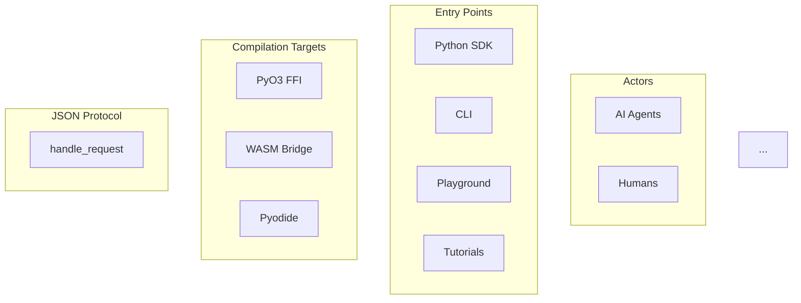

# SAF System Architecture Diagram — Design Document

**Date**: 2026-02-24
**Status**: Approved

## Goal

Create a complete, maintainable system architecture diagram for SAF showing every layer from user entry points (AI agents, humans) through the JSON Protocol contract down to the analysis engines and frontends. Two renderings from a single JSON data source:

1. **Mermaid** — for docs, PRs, and markdown contexts
2. **Fancy interactive React** — standalone `/architecture` page with hover/click interactions, animated data flows, and drill-down detail panels

## Architecture Model

### Key Insight: Protocol-Centric Design

The JSON Protocol (`ProgramDatabase::handle_request`) is the universal funnel. Everything above it is a wrapper (shell); everything below it is analysis infrastructure.

```
              AI Agents              Humans
                 |                     |
    +------------+---------------------+------------+
    |   Python SDK    CLI    Playground   Tutorials  |  <- Shells
    +------------+---------------------+------------+
                 |                     |
    +------------+---------------------+------------+
    |           PyO3 FFI         WASM Bridge         |  <- Compilation targets
    +--------------------+-------------------------+
                         |
    +--------------------+-------------------------+
    |          JSON Protocol (handle_request)        |  <- Universal contract
    +--------------------+-------------------------+
                         |
    +--------------------+-------------------------+
    |   Query & Export: Selectors, PropertyGraph,    |
    |   PTA Export, Checker Specs, Findings/SARIF     |
    +--------------------+-------------------------+
                         |
    +--------------------+-------------------------+
    |   Analysis Engines: ProgramDatabase, CallGraph, |
    |   PTA (Worklist/Datalog), VFG, MSSA, IFDS/IDE  |
    +--------------------+-------------------------+
                         |
    +--------------------+-------------------------+
    |   IR & Frontends: AIR Bundle, LLVM Frontend,   |
    |   AIR-JSON Frontend, Tree-sitter (browser)      |
    +--------------------+-------------------------+
                         |
    +--------------------+-------------------------+
    |   Build & Deploy: Docker/LLVM, wasm-pack,      |
    |   Maturin, GitHub Pages                         |
    +--------------------+-------------------------+
```

### Layers

| # | Layer ID | Label | Color | Description |
|---|----------|-------|-------|-------------|
| 0 | `actors` | Actors | — | AI Agents, Humans |
| 1 | `shells` | Entry Points / Shells | `#0ea5e9` (sky) | Python SDK, CLI, Playground, Tutorials, Docs, Landing Site |
| 2 | `bridges` | Compilation Targets | `#8b5cf6` (violet) | PyO3 FFI, WASM Bridge (wasm-pack), Pyodide Runtime |
| 3 | `protocol` | JSON Protocol | `#f59e0b` (amber) | `handle_request()` — the universal contract |
| 4 | `query` | Query & Export | `#10b981` (emerald) | Selectors, PropertyGraph export, PTA export, Checker Specs, Findings/SARIF |
| 5 | `engines` | Analysis Engines | `#ef4444` (red) | ProgramDatabase, CG, PTA (Worklist/Datalog), VFG, MSSA, SVFG Checkers, IFDS/IDE |
| 6 | `ir` | IR & Frontends | `#6366f1` (indigo) | AIR Bundle, LLVM Frontend, AIR-JSON Frontend, Tree-sitter (browser) |
| 7 | `infra` | Build & Deploy | `#64748b` (slate) | Docker/LLVM 18, wasm-pack, Maturin, GitHub Pages |

### Nodes (per layer)

**Layer 0 — Actors**
- `ai-agents`: AI Agents (icon: robot) — use Python SDK to script analyses
- `humans`: Humans (icon: user) — use Playground, CLI, Tutorials, Docs

**Layer 1 — Entry Points / Shells**
- `python-sdk`: Python SDK (`saf-python`) — `project.points_to()`, `taint_flow()`, `check()`
- `cli`: CLI (`saf-cli`) — command-line binary
- `playground`: Playground — browser IDE with Monaco, QueryPanel, AnalyzerPanel, GraphPanel
- `tutorials`: Tutorials — interactive algorithm stepper with graph visualization
- `docs`: Documentation — mdBook developer docs
- `site`: Landing Site — marketing / overview page

**Layer 2 — Compilation Targets**
- `pyo3`: PyO3 FFI — Rust-to-Python bindings via maturin
- `wasm-bridge`: WASM Bridge (`saf-wasm`) — Rust compiled to WASM via wasm-pack
- `pyodide`: Pyodide Runtime — Python-in-browser, mirrors SDK API via `pyodide-bridge.ts`
- `web-worker`: Web Worker — runs WASM off main thread

**Layer 3 — JSON Protocol**
- `handle-request`: `ProgramDatabase::handle_request(json)` — dispatches all queries
- `schema-action`: `schema` — returns catalog of available checks and graphs
- `check-action`: `check` / `check_all` — run named checkers
- `query-action`: `query` — primitive queries (points_to, alias, taint_flow, flows)
- `analyze-action`: `analyze` — custom analysis with inline config

**Layer 4 — Query & Export**
- `selectors`: Selectors — source/sink specification (JSON-deserializable)
- `property-graph`: PropertyGraph Export — unified format for CFG, callgraph, defuse, valueflow
- `pta-export`: PTA Export — value-to-locations points-to results
- `checker-specs`: Checker Specs — YAML-defined typestate/resource/taint rules
- `findings`: Findings / SARIF — output with path traces, CWE tags, severity

**Layer 5 — Analysis Engines**
- `program-db`: ProgramDatabase — central facade, owns all analysis results
- `callgraph`: Call Graph — CHA + on-the-fly refinement
- `pta`: Pointer Analysis — Andersen-style (Worklist solver, Datalog/Ascent solver)
- `vfg`: Value Flow Graph — sparse value-flow for taint/dataflow
- `mssa`: Memory SSA — store/load reasoning (MemPhi, chi/mu)
- `svfg-checkers`: SVFG Checkers — typestate, resource leak, double-free
- `ifds-ide`: IFDS/IDE Solvers — interprocedural taint, typestate

**Layer 6 — IR & Frontends**
- `air-bundle`: AIR Bundle — canonical intermediate representation
- `llvm-frontend`: LLVM Frontend (`saf-frontends`) — ingests `.ll`/`.bc` via LLVM C API
- `air-json-frontend`: AIR-JSON Frontend — ingests `.air.json` directly
- `tree-sitter`: Tree-sitter (browser) — parses C source to CST, converts to AIR

**Layer 7 — Build & Deploy**
- `docker`: Docker (dev) — Ubuntu 24.04 + LLVM 18 build environment
- `wasm-pack`: wasm-pack — compiles Rust to WASM for browser
- `maturin`: Maturin — builds Python wheels from Rust (PyO3)
- `github-pages`: GitHub Pages — deploys site, playground, tutorials, docs

### Connections

Connections carry a `type` that determines visual style:

| Type | Style | Meaning |
|------|-------|---------|
| `uses` | Solid arrow | Actor uses an entry point |
| `data` | Solid colored | Data flow (JSON, AIR, graphs) |
| `compiles-to` | Dashed | Build/compilation relationship |
| `deploys` | Thin gray dotted | Deployment relationship |
| `planned` | Ghost/faded dashed | Future capability (REST API, MCP) |

Key connections:
- `ai-agents` → `python-sdk` (uses)
- `humans` → `playground`, `cli`, `tutorials`, `docs`, `site` (uses)
- `python-sdk` → `pyo3` (data: "FFI calls")
- `playground` → `pyodide` (data: "Python-in-browser")
- `playground` → `wasm-bridge` (data: "direct WASM")
- `cli` → `handle-request` (data: "native Rust")
- `pyo3` → `handle-request` (data: "same Rust fn")
- `wasm-bridge` → `handle-request` (data: "same Rust fn, WASM target")
- `pyodide` → `wasm-bridge` (data: "JS interop")
- `handle-request` → `check-action`, `query-action`, `schema-action`, `analyze-action` (data: "dispatches")
- `check-action` → `checker-specs`, `svfg-checkers` (data)
- `query-action` → `selectors`, `pta`, `vfg` (data)
- `program-db` → `callgraph`, `pta`, `vfg`, `mssa` (data: "owns")
- `pta` → `callgraph` (data: "refines CG on-the-fly")
- `vfg` → `mssa` (data: "built on MSSA")
- All engines → `air-bundle` (data: "operates on AIR")
- `llvm-frontend` → `air-bundle` (data: "produces")
- `air-json-frontend` → `air-bundle` (data: "produces")
- `tree-sitter` → `air-bundle` (data: "produces (browser)")
- `docker` → `llvm-frontend` (compiles-to)
- `wasm-pack` → `wasm-bridge` (compiles-to)
- `maturin` → `pyo3` (compiles-to)
- `github-pages` → `playground`, `tutorials`, `docs`, `site` (deploys)

## Data Source

### File: `packages/shared/src/architecture/architecture.json`

Single JSON file containing all nodes, layers, connections, and metadata. Both renderers consume this.

### TypeScript types: `packages/shared/src/architecture/types.ts`

Defines `ArchitectureData`, `Layer`, `Node`, `Connection`, `Actor` types for compile-time safety.

### Mermaid generator: `packages/shared/src/architecture/generate-mermaid.ts`

Script that reads `architecture.json` and emits `architecture.mmd`. Run via:
```bash
npx tsx packages/shared/src/architecture/generate-mermaid.ts
```

## Fancy React Renderer

### Route: `/architecture` (standalone page)

Deployed as part of the `site/` app on GitHub Pages.

### Component tree:
```
ArchitecturePage
  ├── ActorBar          (AI Agents | Humans)
  ├── ArchitectureDiagram
  │     ├── Layer (repeated per layer)
  │     │     ├── LayerHeader (collapsible)
  │     │     └── NodeGrid
  │     │           └── Node (repeated)
  │     └── ConnectionOverlay (SVG)
  │           └── ConnectionPath (repeated)
  └── DetailPanel       (slide-in on node click)
        ├── NodeTitle
        ├── Description
        ├── CrateLink → GitHub
        └── RelatedNodes
```

### Interactions:
1. **Hover node** → highlight connected edges + show tooltip
2. **Click node** → open DetailPanel with crate name, source path, key types, GitHub link
3. **Hover connection** → animate pulse along data flow direction
4. **Click layer header** → collapse/expand layer
5. **"Trace" button** → click on any node to highlight full actor→node→...→output path
6. **Responsive** → stacks vertically on mobile

### Visual style (Shannon-inspired):
- Dark background (`#0f172a` slate-900)
- Color-coded layer borders (per layer color table above)
- Rounded boxes with subtle gradient backgrounds
- Monospace labels with descriptions
- SVG connection paths with animated dashes for data flow
- Framer-motion for expand/collapse and panel transitions

## Mermaid Renderer

Auto-generated from the same JSON. Example output:



Limitations vs fancy version: no interactivity, simplified layout, no drill-down. But auto-generated and always in sync.

## File Structure

```
packages/shared/src/architecture/
  architecture.json          # Single source of truth
  types.ts                   # TypeScript types for the schema
  generate-mermaid.ts        # JSON -> .mmd generator script
  architecture.mmd           # Generated output (committed)

site/src/pages/
  architecture.tsx           # /architecture route

site/src/components/ArchitectureDiagram/
  ArchitectureDiagram.tsx    # Main component
  ActorBar.tsx               # Top actor bar
  Layer.tsx                  # Layer container
  Node.tsx                   # Individual node
  ConnectionOverlay.tsx      # SVG connection layer
  ConnectionPath.tsx         # Individual SVG path
  DetailPanel.tsx            # Slide-in detail panel
  useArchData.ts             # Hook to load + process architecture.json
  layout.ts                  # Position calculation for nodes/connections
  styles.module.css          # Scoped styles
```

## Out of Scope

- REST/HTTP API server (future work, shown as "planned" connection)
- MCP server for AI agents (future work)
- Automated sync with crate dependency graph (manual JSON updates for now)
